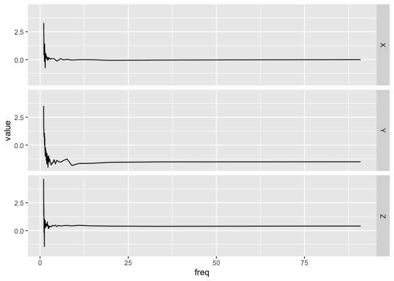

<!-- README.md is generated from README.Rmd. Please edit that file -->

# bis620.2022

<!-- badges: start -->

[](https://github.com/FrankWu520/bis620.2022/actions/workflows/R-CMD-check.yaml)
[](https://github.com/FrankWu520/bis620.2022/actions/workflows/test-coverage.yaml)
[](https://github.com/FrankWu520/bis620.2022/actions/workflows/lint.yaml)
[](https://app.codecov.io/gh/FrankWu520/bis620.2022?branch=main)
<!-- badges: end -->

The goal of bis620.2022 is to get the spectral signature of
accelerometry data and plot UKBiobank accelerometry data. I created this
package to capture functions, data, and documentation for BIS620 class
in Fall 2022.

Using the function `spectral_signature()` in `spectral.R`, you can
obtain the spectral signature of UKBiobank data, which is calculated by
taking the modulus of the Fourier coefficients of the signal. The
function takes a data setwith columns `X`, `Y`, `Z`, and `time`, and
returns a data frame with the modulus of the Fourier coefficients for
the X, Y, and Z channels.

With the function `accel_plot()` in `plot.R`, you can plot UKBiobank
accelerometry data. The function takes a data set that is assumed to
have a `time`, `X`, `Y`, and `Z` column along with either a `time` or
`freq` column, and returns a a time-series plot faceted by axis.

## Installation

You can install the development version of bis620.2022 from
[GitHub](https://github.com/) with:

``` r
# install.packages("devtools")
devtools::install_github("FrankWu520/bis620.2022")
```

## Obtain Spectral Signature

This example shows you how to get the spectral signature of the
accelerometry data:

``` r
library(bis620.2022)
data(ukb_accel)
spec_sig <- spectral_signature(ukb_accel[1:100, ], take_log = TRUE)
spec_sig
#> # A tibble: 50 × 4
#>         X     Y      Z  freq
#>     <dbl> <dbl>  <dbl> <dbl>
#>  1  2.98  3.52   4.64   1.01
#>  2  3.26  1.44   1.43   1.03
#>  3  2.10  1.44   2.26   1.05
#>  4  2.01  1.36   1.58   1.08
#>  5  0.438 1.01   1.01   1.10
#>  6  1.46  0.737 -0.199  1.12
#>  7  0.961 0.962  1.05   1.15
#>  8  1.35  1.06   0.935  1.18
#>  9  1.29  1.06  -1.44   1.20
#> 10 -0.148 0.957  1.04   1.23
#> # … with 40 more rows
```

## Plot Accelerometry Data

This example shows you how to create an accelerometry plot for the
accelerometry data:

``` r
library(bis620.2022)
data(ukb_accel)
accel_plot(ukb_accel[1:1000, ])
```


This example shows you how to create an accelerometry plot for the
spectral signature of the accelerometry data:

``` r
library(bis620.2022)
data(ukb_accel)
spec_sig <- spectral_signature(ukb_accel[1:100, ], take_log = TRUE)
accel_plot(spec_sig)
```


